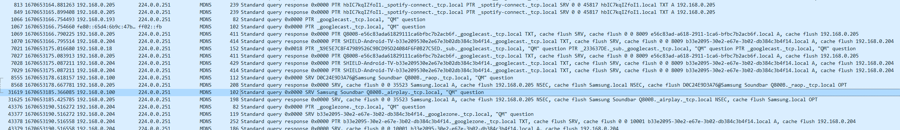

ProcessPortInfo 데이터 클래스
=============

구문
----
```python
@dataclass(order = True)
class ProcessPortInfo:
    tcp : set[np.uint16] = field(default_factory = set[np.uint16])
    udp : set[np.uint16] = field(default_factory = set[np.uint16])
    tcp6 : set[np.uint16] = field(default_factory = set[np.uint16])
    udp6 : set[np.uint16] = field(default_factory = set[np.uint16])
    timestamp : np.int64 = 0
```

<br>

멤버
----
```tcp```  
프로세스 (또는 프로세스들)에서 사용중인 IPv4 tcp 포트 집합입니다.
<br><br>
```udp```  
프로세스 (또는 프로세스들)에서 사용중인 IPv4 udp 포트 집합입니다.
<br><br>
```tcp6```  
프로세스 (또는 프로세스들)에서 사용중인 IPv6 tcp 포트 집합입니다.
<br><br>
```udp6```  
프로세스 (또는 프로세스들)에서 사용중인 IPv6 udp 포트 집합입니다.
<br><br>
```timestamp```  
해당 포트들을 사용하기 시작한 순간의 타임스탬프입니다.  
모든 포트가 시작된 타임스탬프가 아니라, 임의의 한 포트가 추가된 시간을 의미합니다.

<br>

설명
----
```process_packet_caputre_by_process_name```에서 사용되는 데이터 클래스입니다.  
windivert에서 받은 이벤트를 이용하여, ```process_packet_caputre_by_process_name```에서 캡처하고자 하는 process_name을 가진 프로세스의 포트 사용목록을 나타냅니다.

<br>
<br>
<br>

find_local_tcp_ports_by_pid 함수
================================================

구문
----
```python
def find_local_tcp_ports_by_pid(
    [in] pid
) -> set[numpy.uint16]
```

<br>

매개변수
-------
```[in] pid```  
어떤 프로세스를 식별하는 pid입니다.  
int이거나, set(int)여야 합니다.  

<br>

반환값
------
pid가 가리키는 프로세스에서 사용중인 IPv4 로컬 tcp 포트로 이루어진 집합(set)입니다.  
set[numpy.uint16]으로, set의 원소 자료형이 numpy의 uint16임을 유의하십시오.

<br>

설명
----
GetExtendedTcpTable 함수를 이용하여, pid(또는 pid 집합)가 가리키는 프로세스에서 사용중인 IPv4 로컬 tcp 포트 목록을 반환합니다.  

<br>
<br>
<br>

find_local_udp_ports_by_pid 함수
================================================

구문
----
```python
def find_local_udp_ports_by_pid(
    [in] pid
) -> set[numpy.uint16]
```

<br>

매개변수
-------
```[in] pid```  
어떤 프로세스를 식별하는 pid입니다.  
int이거나, set(int)여야 합니다.  

<br>

반환값
------
pid가 가리키는 프로세스에서 사용중인 IPv4 로컬 udp 포트로 이루어진 집합(set)입니다.   
set[numpy.uint16]으로, set의 원소 자료형이 numpy의 uint16임을 유의하십시오.

<br>

설명
----
GetExtendedUdpTable 함수를 이용하여, pid(또는 pid 집합)가 가리키는 프로세스에서 사용중인 IPv4 로컬 udp 포트 목록을 반환합니다.  

<br>
<br>
<br>

find_local_tcp6_ports_by_pid 함수
================================================

구문
----
```python
def find_local_tcp6_ports_by_pid(
    [in] pid
) -> set[numpy.uint16]
```

<br>

매개변수
-------
```[in] pid```  
어떤 프로세스를 식별하는 pid입니다.  
int이거나, set(int)여야 합니다.  

<br>

반환값
------
pid가 가리키는 프로세스에서 사용중인 IPv6 로컬 tcp 포트로 이루어진 집합(set)입니다.  
set[numpy.uint16]으로, set의 원소 자료형이 numpy의 uint16임을 유의하십시오.

<br>

설명
----
GetExtendedTcpTable 함수를 이용하여, pid(또는 pid 집합)가 가리키는 프로세스에서 사용중인 IPv6 로컬 tcp 포트 목록을 반환합니다.  

<br>
<br>
<br>

find_local_udp6_ports_by_pid 함수
================================================

구문
----
```python
def find_local_udp6_ports_by_pid(
    [in] pid
) -> set[numpy.uint16]
```

<br>

매개변수
-------
```[in] pid```  
어떤 프로세스를 식별하는 pid입니다.  
int이거나, set(int)여야 합니다.  

<br>

반환값
------
pid가 가리키는 프로세스에서 사용중인 IPv6 로컬 udp 포트로 이루어진 집합(set)입니다.   
set[numpy.uint16]으로, set의 원소 자료형이 numpy의 uint16임을 유의하십시오.

<br>

설명
----
GetExtendedUdpTable 함수를 이용하여, pid(또는 pid 집합)가 가리키는 프로세스에서 사용중인 IPv6 로컬 udp 포트 목록을 반환합니다.  

<br>
<br>
<br>

packet_capture 함수
================================================

구문
----
```python
def packet_capture(
    [in] interface_name : str, 
    [in] pcap_file_name : str = "tmp_pcap.pcap", 
    [in] send_pipe : multiprocessing.connection.Pipe = None
) -> None
```

<br>

매개변수
-------
```[in] interface_name```  
패킷을 캡처하고자 하는 네트워크 인터페이스의 이름 입니다.
<br><br>
```[in] pcap_file_name```  
캡처한 패킷을 저장할 pcap 파일 이름입니다.  
기본값은 "tmp_pcap.pcap" 입니다.

```[in] send_pipe```  
process_packet_caputre_by_process_name 함수에서 생성한 프로세스 파이프입니다.
기본값은 None 입니다.

<br>

반환값
------
없습니다.

<br>

설명
----

non promiscuous 모드로 인터페이스를 드나드는 패킷을 캡처하여, ```pcap_file_name``` (이는 경로가 될 수 있습니다.)에 저장합니다. 패킷을 캡처할 때 콜백 함수를 이용하며,  콜백함수는 ```py_packet_handler``` 입니다.  
```process_packet_caputre_by_process_name``` 함수 외의 방법으로 이 함수를 호출해서는 안됩니다. 이 경우 예기치 몫한 오류가 발생할 수 있습니다.  

<br>
<br>
<br>

packet_capture 함수
================================================

구문
----
```python
def py_packet_handler(
    dumpfile : ctypes.POINTER(ctypes.c_ubyte), 
    header : ctypes.POINTER(pcap_pkthdr), 
    pkt_data : ctypes.POINTER(ctypes.c_ubyte)
) -> None
```

<br>

매개변수
-------
```[in] dumpfile```  
npcap(winpcap.dll) 라이브러리의 pcap_dump_open 함수를 이용해 생성한, pcap 파일을 가리키는 pcap_duper_t 구조체 포인터입니다.  
매개변수로 넘길때, char형 포인터로 (ctypes.c_ubyte형 포인터로) 캐스팅 해야합니다.
<br><br>
```[in] header```  
패킷의 헤더입니다. npcap(winpcap.dll) 라이브러리의 pcap_loop 함수를 통해서 이 콜백함수를 호출 하면, 자동으로 패킷 해더를 매개변수로 넘겨줍니다.

```[in] pkt_data```  
패킷의 데이터입니다. npcap(winpcap.dll) 라이브러리의 pcap_loop 함수를 통해서 이 콜백함수를 호출 하면, 자동으로 패킷 데이터를 매개변수로 넘겨줍니다.

<br>

반환값
------
packet_capture 함수에서 사용되는, npcap(winpcap.dll) 라이브러리 pcap_loop 함수의 패킷 캡처 콜백 함수입니다.  
packet_capture 외부에서는 사용되지 않습니다.

<br>

설명
----

non promiscuous 모드로 인터페이스를 드나드는 패킷을 캡처하여, ```pcap_file_name``` (이는 경로가 될 수 있습니다.)에 저장합니다. 패킷을 캡처할 때 콜백 함수를 이용하며,  콜백함수는 ```py_packet_handler``` 입니다.  
```process_packet_caputre_by_process_name``` 함수 외의 방법으로 이 함수를 호출해서는 안됩니다. 이 경우 예기치 몫한 오류가 발생할 수 있습니다.  

<br>
<br>
<br>

process_packet_caputre_by_process_name 함수
================================================

구문
----
```python
def process_packet_caputre_by_process_name(
    [in] interface_name : str, 
    [in] process_name : str, 
    [in] pcap_name : str, 
    [in] recv_pipe : multiprocessing.connection.Pipe
) -> None
```

<br>

매개변수
-------
```[in] interface_name```  
패킷을 캡처하고자 하는 네트워크 인터페이스의 이름 입니다.
<br><br>
```[in] process_name```  
패킷을 캡처하고자 하는 프로세스의 이름입니다.  
경로를 포함하지 않습니다.
<br><br>
```[in] pcap_name```  
캡처한 패킷을 저장할 pcap 파일 이름입니다.

```[in] pcap_name```  
start_process_packet_caputre_by_process_name 함수 내부에서 생성한 recv 파이프 입니다.

<br>

반환값
------
없습니다.

<br>

설명
----
프로세스의 이름이 ```process_name```인 프로세스의 IPv4 tcp, IPv4 udp, IPv6 tcp, IPv6 udp패킷을 캡처합니다.  
```start_process_packet_caputre_by_process_name``` 함수 외의 방법으로 이 함수를 호출해서는 안됩니다. 이 경우 예기치 몫한 오류가 발생할 수 있습니다.  
이 함수를 subprocess를 생성하여 호출하게 되면, 우선 packet_capture함수를 다시 subprocess로 생성하여 non promiscuous 모드로 인터페이스를 드나드는 패킷을 백그라운드에서 캡처하게 됩니다. 이때, 캡처한 패킷들은 winapi의 GetTempFileNameW를 통해 현재 디렉토리에서 tmp 파일을 생성하여 저장됩니다.  
이렇게 패킷을 캡처하기 시작한 직후, windivert 라이브러리의 [WinDivertOpen 함수](https://github.com/basil00/Divert/wiki/WinDivert-Documentation#divert_open)를 호출하게 됩니다. 이 순간 부터 네트워크 flow 수립(established)과 삭제(deleted)에 대한 이벤트가 캡처되기 시작합니다. 이러한 flow 수립과 삭제에 대한 이벤트는 이벤트가 발생한 pid가 몇번인지, 프토토콜이 무엇인지, 몇 번 포트인지, 언제 일어났는지에 대한 정보를 포함하고 있으며, 이를 통해 프로세스 패킷 캡처를 위한 필터를 설정할 수 있습니다. 이벤트 캡처에 대해서는 다음 [동작 영상](https://www.youtube.com/watch?v=Z8N8qo5MoGw)을 확인하십시오.  
단, 기술적으로 WinDivertOpen함수가 호출 되기 이전의 flow 수립과 삭제 이벤트는 캡처할 수 없으므로, find_local_tcp_ports_by_pid, find_local_udp_ports_by_pid, find_local_tcp6_ports_by_pid, find_local_udp6_ports_by_pid를 통해 이전에 사용되던 포트를 구하여 초기 필터를 설정하게 됩니다. WinDivertOpen 함수를 통해 구성한 필터만큼 정확한지 아직 확인이 되지 않았으므로, 패킷 캡처를 시작하고 프로세스를 시작하여 전체 flow 이벤트를 캡처할 것을 권장합니다.
<br><br>
이렇게 패킷과 이벤트를 캡처하던중 join_process_packet_caputre_by_process_name를 통해 signal.SIGINT를 파이프를 통해 받게 된다면 패킷캡처와 이벤트 캡처를 중지하고, 수집한 이벤트를 기반으로 패킷 필터를 구성하게 됩니다. 이러한 패킷 필터를 통해 캡처한 전체 트래픽에서 특정 이름을 가진 프로세스에 대한 패킷만 필터링 할 수 있게 됩니다. 이렇게 필터링 된 패킷은 pcap_name 매개변수를 파일이름으로 저장되게 되며, 전체 트래픽을 캡처한 임시 pcap 파일은 삭제됩니다. 이 과정은 순수 파이썬 모듈인 dpkt 모듈을 통해 동작하게 되며, c 라이브러리가 아닌 관계로 상당한 시간이 소요될 수 있습니다
<br><br>
크롬에서 udp 5353 포트에 대한 이슈가 존재합니다. windivert 라이브러리의 문제와 udp 5353 포트의 특수성에 있습니다. udp 5335포트는 크롬에서 통한 스트리밍을 위해 로컬에 존재하는 크롬 캐스트 기능이 존재하는 기기들을 찾기 위해 사용됩니다.
<br><br>
  
(그림 1. 유튜브의 '크롬캐스트 기기로 전송 기능')
<br><br>
  
(그림 2. 캡쳐된 chrome.exe의 udp 5335포트 패킷)
<br><br>
이렇듯 크롬에서 udp 5353 포트는 특수한 용도로 사용됨과 동시에, windivert 라이브러리의 문제로 해당 포트의 패킷을 탐지하지 못할 수 있습니다. 그러나 windivert의 이벤트 캡처를 flow 레이어가 아니라 socket 레이어에서 수행하면 캡처 할 수 있음을 확인하여, 추후 이벤트 캡처를 socket 레이어에서 수행하는 코드로 바꾸어 캡처해나갈 수 있도록 할 예정입니다.
<br><br>
최대한 QA를 통하여 개선(GetTempPathA를 GetTempPathW로 교체, WideCharToMultiByte 함수 사용)을 하였으나 여전히 특정 환경에서는 유니코드 오류로 에러가 날 가능성이 존재합니다. 이는 사용하는 npcap 라이브러리의 함수의 문자열이 모두 char이 이루어져 발생하는 문제로, 추후 지속적으로 개선해나갈 예정입니다.
<br><br>
IPv6 환경에서의 테스트를 진행하지 못했습니다. 따라서 IPv6 환경에서의 정상 작동을 보장 할 수 없습니다.

<br>
<br>
<br>